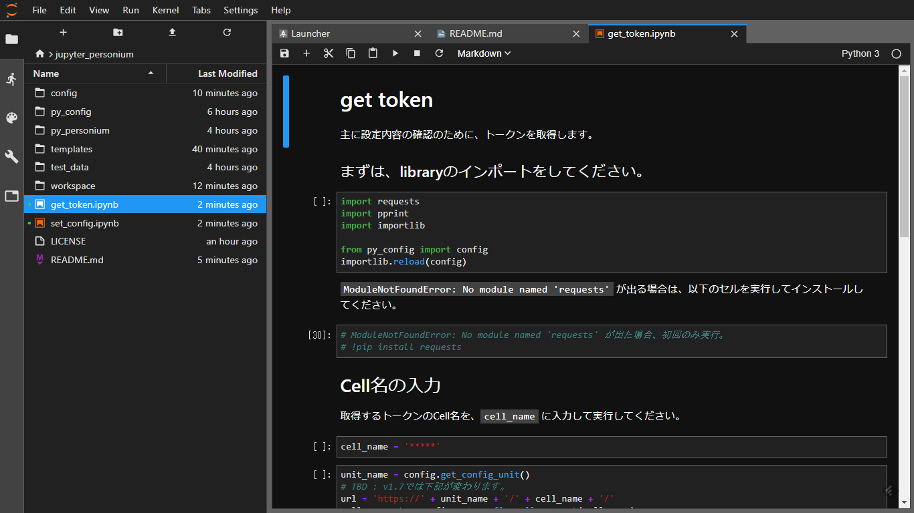

# jupyter-personium
Personium APIをpythonで実行して試行するためのセットです。  
pythonとPersoniumの勉強のために作成しております。
ひとまず自作のEngineScriptを実行するために必要なものを色々作成しています。

## 前提、制限
* jupyter labで実行すること。
* tokenが取得可能なCellが作成済みであること。
* unit権限操作は想定していません。
* とりあえず、v1.6系のURL想定です（ `https://unit/cell/` ）

## 検証範囲
* user権限
* proxy環境下ではない

## 注意事項
説明文で、`Cell` と記載している場合、PersoniumのCellを指しています。  
片仮名で、`セル` と記載している場合、JupyterLabのセルを指しています。  
※分かりづらい且つ間違って記載する可能性もあります。文脈より判断をお願いします。

ご自身の環境に合わせて修正してほしいセルについては、`★` マーク付けておきます。

### はじめに、環境設定をおこないます。
[set_config.ipynb](set_config.ipynb) にあるスクリプトを実行してください。

### 設定が正しくできたか、Tokenの取得ができるかで確認しましょう。  
[get_token.ipynb](get_token.ipynb) に進んでください。